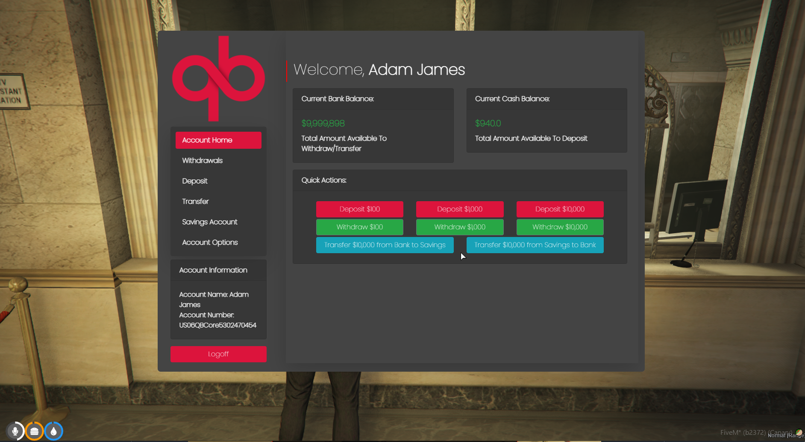

# 🏦 qb-banking


This resource is currently being re-worked and merged with qb-atms


## Introduction

* Multiple ATM's & banks around the map to interact with.
* Saving accounts & debit cards

## Preview

<figure><figcaption></figcaption></figure>

## Configuration

```
Config = {}
Config.cardTypes = {} -- Define the card names which correspond to the item
Config.Zones = {} -- Supply the polyzone box data for the bank access points
Config.Blip = {} -- Define the data used for the bank map blips
Config.ATMModels = {} -- List the object models of the ATM machines that can be used
Config.BankLocations = {} -- Define the coordinates for the bank blips
```
